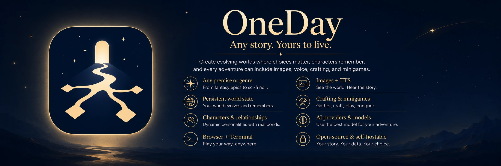

<div align="center">

# OneDay

<p><strong>Any story. Yours to live.</strong></p>

[](https://github.com/Crimsab/oneday/actions/workflows/ci.yml)
[](https://github.com/Crimsab/oneday/releases/latest)
[](go.mod)
[](docs/docker.md)
[](LICENSE)



OneDay turns any premise into a persistent, interactive world. Write any action,
follow or reject suggested choices, and explore stories that remember what
happened and evolve around the consequences. Combat is optional; the genre,
tone, language, rules, and play style belong to each story.

**Any genre · Free-form actions · Branching timelines · Minigames · Crafting ·
Investigations · Optional combat · Images and voices**

[Get started](#quick-start) · [Documentation](docs/README.md) ·
[Releases](https://github.com/Crimsab/oneday/releases) ·
[Report a bug](https://github.com/Crimsab/oneday/issues/new/choose)

</div>

## More than generated prose

- **Any story you can describe.** Mystery, romance, political drama, comedy,
  horror, science fiction, slice of life, fantasy, or something entirely new.
- **One world, not a disposable chat.** Characters, locations, factions,
  investigations, projects, achievements, inventory, and consequences persist.
- **Real player agency.** Pick a suggested choice or write any action in your
  own words; the story is not limited to a dialogue tree.
- **Systems that fit the scene.** Challenges, contextual minigames, crafting,
  social confrontations, investigations, projects, and optional combat create
  interaction without forcing every story into an RPG template.
- **Branch without losing canon.** Fork decisions, explore alternate paths,
  restore snapshots, and navigate history with branch-aware world state.
- **Consequences the engine can trust.** Checks, rewards, inventory changes,
  relationships, crafting outcomes, and turn commits are resolved outside the
  model's free-form prose.
- **Long-term memory.** RAG summaries and embeddings keep long-running stories
  grounded without treating the entire transcript as one prompt.
- **Optional generated media.** Scene art, character portraits, transparent map
  symbols, native source-image edits, brush-mask inpainting, ambient ASCII, and
  spoken audio remain subordinate to canonical text.

## What lives inside a story

| Story experience | Persistent systems |
| --- | --- |
| Any genre, tone, language, and writing style | Characters, locations, factions, relationships, reputation, and world events |
| Free actions, dialogue, suggested choices, and story guidance | Atomic turns, saves, rewind, alternative branches, and searchable history |
| Scene-aware challenges and minigames | Stats, skills, items, relationships, dice, outcomes, rewards, and fail-forward consequences |
| Crafting, investigations, projects, social duels, and optional combat | Inventory, recipes, clues, suspects, leverage, fronts, achievements, and progression |
| Scene art, portraits, maps, ASCII, and spoken audio | Branch-aware media lineage, provider routing, retries, and non-blocking failure |

Automatic timing-free minigames include deduction, negotiation, pattern solving,
bidding, courtroom exchanges, and comedy. The extension engine also supports
riddles, memory, rock-paper-scissors, and quick-time definitions. Read the
[feature tour](docs/features.md) and [story systems guide](docs/story-systems.md)
for the complete behavior.

## Interfaces

### Browser

The React interface is served by a Rust/Axum gateway over the same Go engine and
database as the terminal client. It includes the transcript, story library,
free-action composer, command palette, history and branches, canonical state
inspectors, maps, challenges, model settings, audio, and a full-resolution
visual editor with brush/eraser masks, zoom, pan, and local stroke history.

### Desktop

The Windows/Linux desktop client can either connect to one HTTPS OneDay server
or run a bundled local gateway and engine in an isolated standalone profile.
Remote mode creates no local story database; standalone mode is local-only.
They do not synchronize, merge, or share stories automatically. See [Desktop
client](docs/desktop.md) before choosing a profile.

### Terminal

The Bubble Tea client provides the complete narrative loop, guided story
creation, slash commands, choices and free actions, combat/crafting surfaces,
history, saves, diagnostics, and local CLI provider integrations.

## Quick start

### Browser with Docker

```bash
git clone https://github.com/Crimsab/oneday.git
cd oneday
./scripts/docker-init.sh
```

The initializer creates private local configuration, generates the reusable
browser bootstrap credential, pulls the image, and starts the stack without
overwriting existing settings. Retrieve the credential only when the login
screen asks for it:

```bash
./scripts/docker-bootstrap-token.sh
curl -fsS http://localhost:8788/api/health
```

Open [http://localhost:8788](http://localhost:8788). The first start creates and
migrates the persistent database automatically. Open **Setup** after signing in
to configure a narrative provider. Visual and spoken media are optional and
remain disabled until their providers are configured.

Docker does not bundle host Codex or Claude CLI credentials. The standard
container path is LiteLLM/OpenRouter; advanced users can add private CLI mounts
through a Compose override.

### Terminal from source

Requires Go 1.25.12 or newer:

```bash
git clone https://github.com/Crimsab/oneday.git
cd oneday
go run ./cmd/oneday setup
go run ./cmd/oneday doctor
go run ./cmd/oneday
```

For builds and release availability, consult the [Releases
page](https://github.com/Crimsab/oneday/releases). Do not assume a package exists
for every operating system or that a package includes every optional provider.

Read [Your first story](docs/first-story.md) for the shortest provider-to-story
walkthrough, or the full [getting-started guide](docs/getting-started.md) for
Docker-host networking, RAG, and verification details.

## AI providers and media

| Integration | Use |
| --- | --- |
| Codex CLI | Local generation through an existing `codex login` |
| Claude Code | Optional local CLI fallback |
| LiteLLM / OpenAI-compatible | Self-hosted or managed model gateway |
| OpenRouter | Direct hosted model routing |
| Ollama / custom HTTP | Local RAG embeddings |
| Codex OAuth, OpenAI, Gemini, fal.ai, Replicate, Stability, Azure, or compatible image APIs | Explicit non-blocking story visual providers |

Narrative, utility, repair, embedding, ASCII, image, map-icon, and TTS paths can
use separate models. Codex OAuth is the default visual provider and uses the
Codex-only imagegen-bridge with `codex-responses` as its recommended route and
`codex-app-server` as its compatibility fallback. Vendor API-key providers use
separate direct OneDay adapters. General art and transparent map symbols can use
independent providers and models.

During story creation, visual direction can be Auto, Photorealistic, Cinematic
Fantasy, Illustrated Fantasy, Anime, or a custom prompt. The selected direction
is persisted with the story for consistent later assets.

See [Configuration](docs/configuration.md) for the complete model, RAG, media,
storage, and secret-handling reference.

## How it works

```text
Terminal client ─┐
                 ├─ Go story engine + provider router ─ SQLite
React browser ─ Rust gateway ─ typed JSON bridge ┘
                 └─ SSE events + generated media
Desktop ─ remote server or isolated loopback gateway ┘
```

The Go engine owns narrative prompts, mechanics, persistence, migrations, and
canonical mutations. The Rust gateway owns HTTP, SSE, media jobs, and the typed
bridge. React renders canonical story state but never invents a second source of
truth.

Read [Architecture](docs/architecture.md) and the
[browser gateway contract](docs/browser-gateway.md) for the full turn flow and
component boundaries.

## Documentation

| Guide | Covers |
| --- | --- |
| [Getting started](docs/getting-started.md) | Native and Docker installation |
| [Your first story](docs/first-story.md) | Configure a provider and create the first world |
| [Feature tour](docs/features.md) | Player-facing capabilities and interfaces |
| [Story systems](docs/story-systems.md) | Branches, challenges, minigames, crafting, investigations, projects, and conflict |
| [Generated media](docs/media.md) | Images, maps, ASCII, TTS, providers, and failure behavior |
| [Image providers](docs/image-providers.md) | Codex OAuth and direct vendor adapter coverage |
| [Observability](docs/observability.md) | Optional OpenTelemetry, Langfuse, local diagnostics, privacy, and verification |
| [Configuration](docs/configuration.md) | Providers, RAG, visuals, game settings, and secrets |
| [Docker](docs/docker.md) | Networking, persistence, updates, backups, and operations |
| [Desktop](docs/desktop.md) | Remote and standalone profiles, data isolation, and sidecar limits |
| [Extensions](docs/extensions.md) | Story packs, challenge pools, and minigame definitions |
| [Architecture](docs/architecture.md) | Components, contracts, turn flow, and canonical state |
| [Security threat model](docs/security-threat-model.md) | Trust boundaries, mitigations, and deployment responsibilities |
| [Troubleshooting](docs/troubleshooting.md) | Provider, RAG, media, browser, and CI failures |
| [Development](docs/development.md) | Toolchains, layout, tests, and generated contracts |
| [Testing](docs/testing.md) | Automated gates, browser coverage, and manual release checks |
| [Localization](docs/localization.md) | Interface catalogs, fallback rules, language boundaries, and contributor checks |
| [Documentation site](docs/wiki.md) | Material for MkDocs and GitHub Pages workflow |
| [Benchmarks](docs/benchmarks/README.md) | Reproducible model, ASCII, and schema reliability comparisons |
| [Roadmap](docs/project-roadmap.md) | Current priorities and contribution directions |
| [Releases](docs/releases.md) | Changelog automation, versioning, tags, and artifacts |

## Development

The repository uses Go 1.25.12, Rust 1.97, React 19, TypeScript, Vite, and Bun.

```bash
make verify
cargo test --manifest-path gateway/Cargo.toml
cd gateway/web && bun install --frozen-lockfile && bun run test && bun run build
```

One consolidated CI job runs Go verification, reachable vulnerability scanning,
and cross-compilation; Rust tests and Clippy; web unit and Playwright gates; a
complete Docker build with version smoke checks; workflow linting; and a
Gitleaks source scan. Public pull requests run only on GitHub-hosted runners.

See [CONTRIBUTING.md](CONTRIBUTING.md) before opening a pull request.

## Releases and project status

OneDay is under active development. Back up persistent story data before an
upgrade and review the [changelog](CHANGELOG.md) for migration-sensitive changes.

Release automation manages release metadata and publication when a release is
made. Verify the publisher, version, signature information where supplied, and
the contents of a specific artifact before trusting it; this README does not
guarantee that a particular package or updater feed is available.

## Community and security

- [Support](SUPPORT.md)
- [Security policy](SECURITY.md)
- [Code of conduct](CODE_OF_CONDUCT.md)
- [Contributing](CONTRIBUTING.md)

OneDay is local/self-hosted software. If you expose it to an untrusted network,
you are responsible for authentication, TLS, network policy, backups, and
protecting provider credentials.

## License

OneDay is available under the [MIT License](LICENSE).
